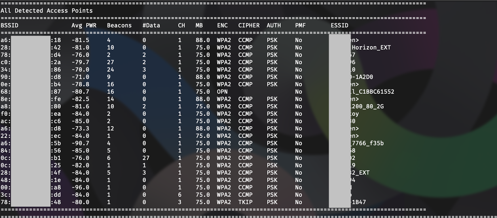
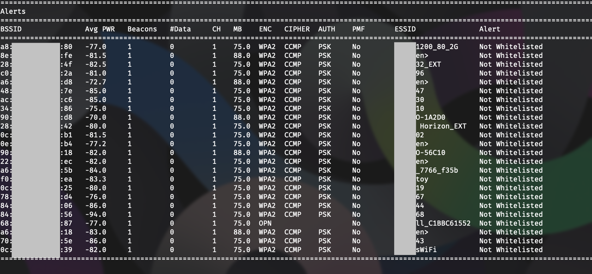
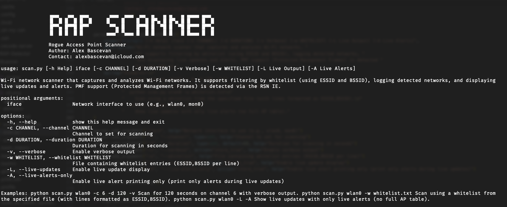

# Wi-Fi Rogue Access Point Detection Tool

This Python script is designed to capture and analyze Wi-Fi networks to detect rogue or unwhitelisted access points. It supports filtering by whitelist (based on ESSID and BSSID), logging detected networks, and displaying live updates with alerts for rogue or suspicious networks.

## Features

- **Wi-Fi Scanning**: Uses Scapy to capture and analyze beacon and data frames from nearby Wi-Fi networks.
- **Whitelist Filtering**: Option to filter networks based on a whitelist of ESSID and BSSID.
- **Live Updates**: Display live scanning results and alerts with a customizable scan duration.
- **Alert Types**: Detect rogue networks and evil twin attacks, displaying alerts for any suspicious networks.
- **PMF Detection**: Supports Protected Management Frames (PMF) detection via RSN Information Element (IE).

## Prerequisites

# Wi-Fi Adapter MUST support Monitor Mode

Ensure that the following libraries are installed:

- `scapy`: A powerful interactive packet manipulation program.
- `argparse`: To handle command-line arguments.
- `json`: For storing scan results and alerts in JSON format.

You can install Scapy using pip if it's not already installed:

```bash
pip install scapy
```

## Usage

Run the script with the following command:

```bash
python scan.py <interface> [options]
```

Where `<interface>` is the network interface to use for scanning (e.g., `wlan0`, `mon0`).

### Arguments

- `-c` `--channel`: Set the channel to scan (default: all channels).
- `-d` `--duration`: Set the duration for scanning in seconds (default: 60).
- `-v` `--verbose`: Enable verbose output to display detailed information for each detected AP.
- `-w` `--whitelist`: Path to a file containing the whitelist of ESSID and BSSID (one per line in the format `ESSID,BSSID`).
- `-L` `--live-updates`: Display live updates of detected networks.
- `-A` `--live-alerts-only`: Show only live alerts (no full AP table).

### Examples

1. Scan for 120 seconds on channel 6 with verbose output:

    ```bash
    python scan.py wlan0 -c 6 -d 120 -v
    ```

2. Scan using a whitelist file:

    ```bash
    python scan.py wlan0 -w whitelist.txt
    ```

3. Show live updates with only live alerts (no full AP table):

    ```bash
    python scan.py wlan0  -A
    ```
4. Scan using whitelist with live updates for 10 seconds:

    ```bash
    python scan.py wlan0 -d 10 -L
    ```


